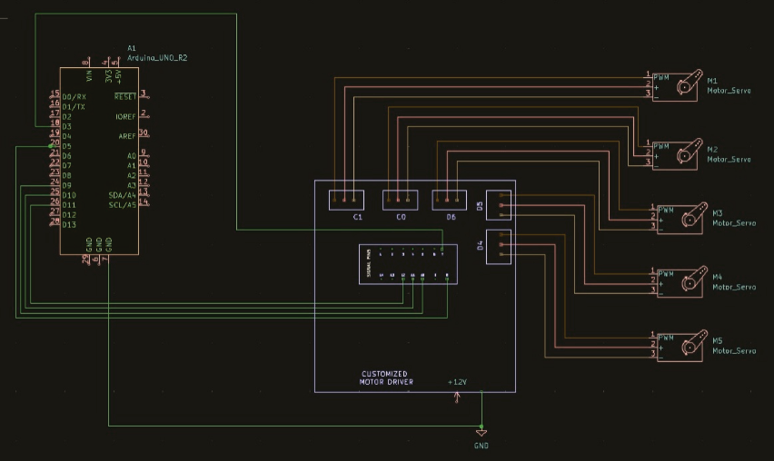
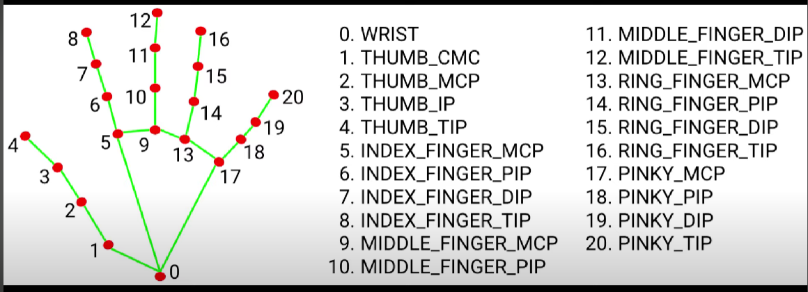

# Cam Arm

## Project Overview
The project aims to develop a real-time hand gesture recognition system that detects and tracks hand movements using Mediapipe and Opencv and communicates the recognized gestures to an Arduino for further actions. It also demonstrates the integration of computer vision for gesture recognition with hardware control based on hand gestures.





## HARDWARE:
The Arduino UNO controls the robotic arm by sending command signals to the servo motor driver. 
The servo motor driver interprets these signals and supplies the necessary current to the servo motors, which then deflect the fingers of the arm according to the specified motion. 
Springs facilitate the fingers ‘back-and-forth’ motion, and an SMPS provides the main power supply to the motors.
For efficient working of our robotic arm we have replaced our Arduino UNO by a Raspberry Pi
Raspberry Pi Pico is a low-cost, high-performance microcontroller board with flexible digital interfaces. 

## CONNECTIONS:
● The PWM pins from the Raspberry Pi are connected to the signal ports of the motor driver.
● The servo motors’ pins are also connected to the motor driver with respect to their power, signal, and ground pins.
● The whole circuit is powered using an SMPS which supplies 12V connected to the customized motor driver.
Raspberry pico W helps to enable wireless communication.
Pin configuration

(The pins can be connected according to your choice but they must all be PWM signal pins and corresponding servo motor pins must be connected accordingly.)
| Finger   | PWM Pins   | Motor Driver Pins |
|----------|------------|-------------------|
| Index    | 3          |c1                 |
| Ring     |5           |D5                 |
| Thumb    |9           |D4                 |
| Middle   |10          |C0                 |
| Pinky    |11          |D6                 |

# CIRCUIT 


# Budget And Resource
| Component              | Price  |
|------------------------|--------|
| Raspberry Pi Pico W    | ₹700   |
| MG995 Servo Motor [5]  | ₹1475  |
| Acrylic Sheet          | ₹599   |
| Spring                 | ₹299   | 
| Servo Motor Driver     | ₹700   |
| Jumper Cable           | ₹150   |
| SMPS                   | ₹570   |
## Total Budget :₹4493

# SOFTWARE:
## Hand Tracking and Communication via socket (Python):
The Python script uses OpenCV to capture and process video from a webcam and Mediapioe to detect and track hand landmarks in real time.This script demonstrates the setup for image processing and hardware communication applications using openCV,Mediapipe,and Socket.
● OpenCV: open source computer vision library for computer vision
● Mediapipe: a cross-platform framework for building multimodal.
● Socket : Socket library in Raspberry Pi Pico W are used for network communication
●Raspberry Pi Pico W :  wireless communication using Wifi Module.

# Working code (Python):
```
import cv2
import mediapipe as mp
import math
import socket

   // Function to calculate angle between three points (p1, p2, p3)
def calculate_angle(p1, p2, p3):
    angle_rad = math.atan2(p3[1] - p2[1], p3[0] - p2[0]) - math.atan2(p1[1] - p2[1], p1[0] - p2[0])
    angle_deg = math.degrees(angle_rad)
    return angle_deg + 360 if angle_deg < 0 else angle_deg

    // Function to update hand state array
def update_hand_state(thumb_bent, index_bent, middle_bent, ring_bent, pinky_bent):
    hand_state = [int(thumb_bent), int(index_bent), int(middle_bent), int(ring_bent), int(pinky_bent)]
    return hand_state

   // Set up socket communication
host = '192.168.253.40'  # Replace with your Pico W IP address
port = 8080
client_socket = socket.socket(socket.AF_INET, socket.SOCK_STREAM)
client_socket.connect((host, port))

   // Initialize MediaPipe hands module
mp_hands = mp.solutions.hands
hands = mp_hands.Hands(static_image_mode=False, max_num_hands=1, min_detection_confidence=0.5, min_tracking_confidence=0.5)

    // Initialize MediaPipe drawing utilities
mp_drawing = mp.solutions.drawing_utils

    // Open default camera
cap = cv2.VideoCapture(0)

while cap.isOpened():
    ret, frame = cap.read()
    if not ret:
        print("Failed to read from camera.")
        break

       //Get the dimensions of the frame
    height, width, _ = frame.shape

       // Define the box dimensions
    box_left = width // 4
    box_top = height // 4
    box_right = 3 * width // 4
    box_bottom = 3 * height // 4

       // Draw a box in the middle of the frame
    cv2.rectangle(frame, (box_left, box_top), (box_right, box_bottom), (255, 0, 0), 2)

        // Convert the image to RGB
    frame_rgb = cv2.cvtColor(frame, cv2.COLOR_BGR2RGB)

        // Process the image
    results = hands.process(frame_rgb)

         // Draw hand landmarks and analyze finger angles
    if results.multi_hand_landmarks:
        for hand_landmarks in results.multi_hand_landmarks:
            # Get the landmark positions
            landmarks = []
            for lm in hand_landmarks.landmark:
                x = int(lm.x * width)
                y = int(lm.y * height)
                landmarks.append((x, y))

                  // Check if the hand is within the box
            hand_x, hand_y = landmarks[0]  # Using the position of the wrist
            if box_left < hand_x < box_right and box_top < hand_y < box_bottom:
                      // Draw hand landmarks
                mp_drawing.draw_landmarks(frame, hand_landmarks, mp_hands.HAND_CONNECTIONS)

                    // Calculate finger bending status based on x and y coordinates
                thumb_bent = landmarks[4][0] >= landmarks[3][0]
                index_bent = landmarks[8][1] < landmarks[6][1]
                middle_bent = landmarks[12][1] < landmarks[10][1]
                ring_bent = landmarks[16][1] < landmarks[14][1]
                pinky_bent = landmarks[20][1] < landmarks[18][1]

                    // Update hand state array
                hand_state = update_hand_state(thumb_bent, index_bent, middle_bent, ring_bent, pinky_bent)

                   // Print hand state in terminal
                print("Hand State:", hand_state)

                   // Send hand state to Raspberry Pi Pico W
                hand_state_str = ''.join(map(str, hand_state)) + '\n'
                client_socket.send(hand_state_str.encode('utf-8'))

                    // Display finger status on the image
                font = cv2.FONT_HERSHEY_SIMPLEX
                cv2.putText(frame, f'Thumb: {"Straight" if thumb_bent else "Bent"}', (10, 30), font, 0.7, (0, 255, 0), 2, cv2.LINE_AA)
                cv2.putText(frame, f'Index: {"Straight" if index_bent else "Bent"}', (10, 60), font, 0.7, (0, 255, 0), 2, cv2.LINE_AA)
                cv2.putText(frame, f'Middle: {"Straight" if middle_bent else "Bent"}', (10, 90), font, 0.7, (0, 255, 0), 2, cv2.LINE_AA)
                cv2.putText(frame, f'Ring: {"Straight" if ring_bent else "Bent"}', (10, 120), font, 0.7, (0, 255, 0), 2, cv2.LINE_AA)
                cv2.putText(frame, f'Pinky: {"Straight" if pinky_bent else "Bent"}', (10, 150), font, 0.7, (0, 255, 0), 2, cv2.LINE_AA)

                      // Display the hand state array
                cv2.putText(frame, f'Hand State: {hand_state}', (10, 180), font, 0.7, (0, 255, 255), 2, cv2.LINE_AA)

         // Display the resulting frame
    cv2.imshow('Hand Tracking', frame)

        // Exit when 'ESC' is pressed
    if cv2.waitKey(5) & 0xFF == 27:
        break

    // Release resources
cap.release()
cv2.destroyAllWindows()
client_socket.close()


## Wi-Fi Controlled Servo Motors using ESP32 And Python Sockets:
The code demonstrates how to connect an ESP32 to a Wi-Fi network, with setting up     a socket server, and  to control servo motors based on commands received over the   network. The software handles the Wi-Fi connection, initializes the PWM for servos,   sets up the socket server, and processes incoming data to control the servos .

=> Set_servo_angle function : maps the angle to the corresponding pulse width and sets the duty cycle for the servo. If the state is 1,then it is bent or it is straight.
=> Socket setup : Bonds the socket to all available network interfaces on port 8080.
=> Handling connections :  Accepts a client connection and prints the client's address.Reads data from  the client connection and processes it line by line.
=> Decodes and splits the received data, and updates the servos based on the received hand state.Handles any exceptions that occur during data processing.
=> Connection to Wi-Fi : specify the SSID and Password for initializing the connection.
=> Set Up PWM for Servos : Initialize the PWM for each servo pin with frequency te.Handles any exceptions that occur during data processing.

## Working Code of Raspberry Pi Pico W:

```
import network
import socket
from machine import Pin, PWM
from time import sleep

   // Wi-Fi connection details
ssid = 'Sow'
password = '11111111'


   // Connect to Wi-Fi
wlan = network.WLAN(network.STA_IF)
wlan.active(True)
print('Connecting to Wi-Fi...')
wlan.connect(ssid, password)

   // Debug statement to indicate connection attempt
print(f'Attempting to connect to {ssid}...')

    // Wait for connection
while not wlan.isconnected():
    sleep(1)
    print('Waiting for connection...')

   // Debug statement to confirm connection
print('Connected to Wi-Fi')

   // Check if connected and get IP address
if wlan.isconnected():
    ip = wlan.ifconfig()[0]
    print(f'IP Address: {ip}')
else:
    print('Failed to get IP address')

   // Set up PWM for servos
servo_pins = [0, 1, 2, 3, 4]  # GPIO pins connected to the servos
servos = [PWM(Pin(pin)) for pin in servo_pins]
for servo in servos:
    servo.freq(50)  # Typical servo frequency

def set_servo_angle(servo, state):
    if state == 1:
        angle = 100  # Bent position
    else:
        angle = 0  # Straight position
    min_pulse = 1000
    max_pulse = 9000
    pulse_width = min_pulse + (max_pulse - min_pulse) * (angle / 180)
    servo.duty_u16(int(pulse_width))

    // Socket setup
addr = socket.getaddrinfo('0.0.0.0', 8080)[0][-1]
s = socket.socket()
s.bind(addr)
s.listen(1)

print('Listening on', addr)

     // Main loop
while True:
    cl, addr = s.accept()
    print('Client connected from', addr)
    cl_file = cl.makefile('rwb', 0)
    while True:
        line = cl_file.readline()
        if not line or line == b'\r\n':
            break
        try:
               // Decode and strip newline characters
            data = line.decode().strip()
            print(f"Received raw data: {data}")  # Print the raw data for debugging
            
                // Convert data to a list of integers
            hand_state = list(map(int, data))
            if len(hand_state) == 5:
                print(f"Received hand state: {hand_state}")  # Print the received hand state
                for i, state in enumerate(hand_state):
                    set_servo_angle(servos[i], state)
        except Exception as e:
            print('Error:', e)
    cl.close()
```

# Goals   
## Precision and efficient:
The robotic arm can be used to achieve unparalleled precision in material handling, sorting, and minimizing operational errors in dynamic and unstructured environments. Additionally, it aims to enhance safety and efficiency by automating complex tasks that traditionally require skilled manual labor.
## Education Purpose:
Serve as an educational tool for teaching robotics, programming,and engineering principles.
## Automation:
 Automate repetitive or dangerous tasks to increase efficiency and safety in industrial settings.
## Flexibility:
Design a versatile robotic arm capable of performing a wide range of tasks by changing tools or programming.
## Adaptability:
The robotic arm can also include the ability to learn and adapt to new tasks through machine learning algorithms, thus continuously improving its performance over time. Additionally, it aims to provide real-time feedback and diagnostics, enabling proactive maintenance and reducing downtime in industrial operations.
## Remote Operation:
Enable remote control and monitoring, allowing the arm to be operated from a distance, which is crucial for hazardous environments.

# Objectives
## Wi-Fi Connectivity:
Establish reliable Wi-Fi connectivity for remote operation and monitoring.
## Servo Control: 
Implement precise control of servo motors to ensure accurate movements and positioning of the robotic arm.
## Real-Time Communication:
Set up a robust socket communication protocol to receive and process commands in real-time.
## Safety and Security:
Incorporate authorization mechanisms to prevent unauthorized access and add debounce protection to avoid accidental multiple triggers.
## Stability and Reliability: 
Include scheduled reboots to maintain long-term system stability and handle error conditions gracefully.
## Ease of Use: 
Develop user-friendly interfaces and documentation to make the robotic arm accessible to users with varying levels of technical expertise.
## Scalability: 
Design the system to be easily scalable, allowing for the addition of more features or components without significant redesign.

# Key Features
## Real-Time Hand Gesture Recognition:
Utilizes OpenCV and Mediapipe to capture and process video from a webcam, enabling real-time detection and tracking of hand landmarks.
Recognizes and interprets hand gestures instantly, ensuring responsive control of the robotic arm.
## Integration of Computer Vision and Hardware Control:
Combines computer vision techniques for gesture recognition with hardware control via Pico W.
Demonstrates seamless communication between software (Python scripts) and hardware (Raspberry Pi Pico W and servo motors).
## Wireless Communication:
Employs Socket for reliable serial communication between the computer and the Pico Board.
Transmits digital data representing hand gestures to the Pico in real-time, enabling precise control of the servo motors.
## Servo Motor Control:
Thonny code receives commands from the Python script and adjusts the servo motors based on the recognized hand gestures.
Five servo motors correspond to the five fingers, allowing for individual finger movement and complex gestures.


